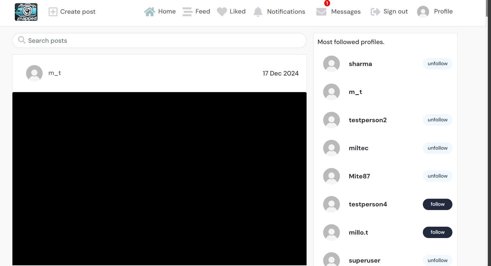
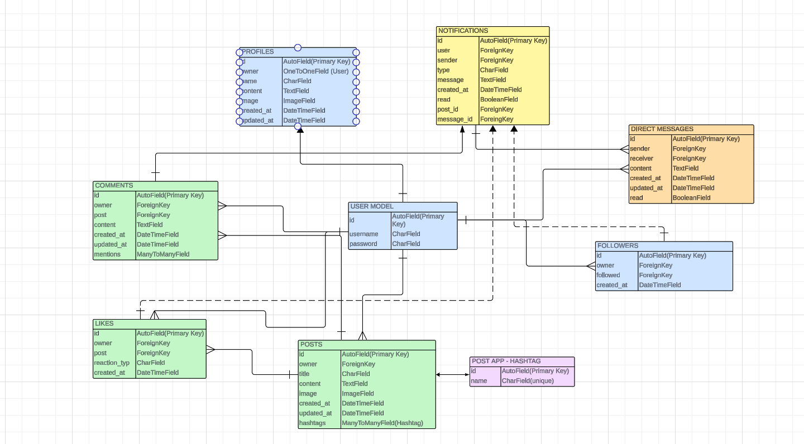

# Znapped

Znapped is a social media application built using React.js for the frontend and Django REST Framework for the backend. It allows users to create posts, follow other users, like and comment on posts, send direct messages and manage notifications. The platform emphasizes user interaction and engagement through intuitive UI and dynamic content.

Live Links
- Frontend live Site: [Znapped](https://znapped.vercel.app/)
- Backend live API: [Znapped API](https://znapped-drfapi-8eee30ca5ab2.herokuapp.com/)

- Backend repository: [Backend repository](https://github.com/MilenTecle/znapped-drf-api/tree/main)

## Contents

- [UI/UX](#)
    - [Project Sections](#project-sections)
    - [User Stories](#user-stories)
    - [Agile](#agile)
    - [Site Owner Goals](#site-owner-goals)
    - [5 planes of UX](#5-planes-of-ux)
    - [Design](#design)
        - [Images](#images)
        - [Colour Scheme](#colour-scheme)
        - [Typography](#typography)
        - [Responsive Design](#responsive-design)
        - [Wireframes](#wireframes)
- [Features](#features)
 -  [Authentication](#authentication)
  - [Navigation](#navigation)
  - [Posts](#posts)
  - [Comments](#comments)
  - [Profiles](#profiles)
  - [Notifications](#notifications)
  - [Messaging](#messaging)
  - [Features left to implement](#features-left-to-implement)
- [Reusable Components](#reusable-components)
    - [General](#general)
    - [Context-specific](#context-specific)
- [Custom hooks](#custom-hooks)
- [Utilities](#utilities)
- [CRUD](#crud)
- [Database design](#database-design)
- [Testing](#testing)
- [Technologies & Languages used](#technologies--languages-used)
- [Libraries & Frameworks](#libraries--frameworks)
- [Tools & Programs](#tools--programs)
- [Deployment](#deployment)
    - [Github](#github)
    - [Vercel](#vercel)
- [Credits](#credits)
  - [Code](#code)
  - [Content](#content)
  - [Media](#media)
  - [Acknowledgements](#acknowledgements)

## UX/UI

## Project Sections
The frontend is built using React.js and includes:
- User Authentication (Sign Up, Sign In, Token Management)
- CRUD Features: Create, read, update, delete posts, comments, messages and notifications.
- Notifications: Interactive notifications for likes, messages and followers.
- Responsive Design: The app is fully optimized for all screen sizes.

## User Stories

### Navigation & Authentication
- Navbar: As a user, I can access a navigation bar on every page so I can easily browse between different sections of the app.
- Seamless Navigation: As a user, I can navigate between pages without refreshing so that I experience fast and smooth transitions.
- Sign Up: As a user, I can create an account so that I can access features available only to registered users.
- Sign In: As a user, I can log into my account so that I can use the functionality available to logged-in users.
- Logged-in Status: As a user, I can easily tell whether I am logged in or not so that I know when I need to sign in.
- Token Refresh: As a logged-in user, I can stay logged in until I choose to log out so that my session is maintained without interruptions.
- Conditional Navbar: As a logged-out user, I can see sign-in and sign-up options in the navbar so that I can access my account or create a new one.

### Post Interaction (Comments, Likes, Edit)
- Post Comments: As a user, I can read comments on a post so that I can engage with the community’s thoughts on the content.
- Add Comments: As a logged-in user, I can comment on posts so that I can share my opinions or reactions.
Like posts: As a logged-in user, I can like posts with different reactions so that I can express appreciation or support for content that interests me.
- Like Notifications: As a user, I will receive notifications when someone likes my post so that I know when my content is appreciated.
- Liked Posts: As a logged-in user, I can view a collection of posts I’ve liked so that I can easily revisit content I enjoy.
- Comment Notifications: As a user, I will receive notifications when someone comments on my post so that I stay informed about new interactions.
- Edit Posts: As a post owner, I can edit the title or description of my post so that I can update or correct content after posting.
- Delete/Modify Comments: As a comment owner, I can delete or edit my comments so that I can control the content I’ve shared.

### The Feed on homepage
- View Recent Posts: As a user, I can see the latest posts ordered by the most recent so that I stay up to date with new content.
- Search Posts: As a user, I can search for posts by keywords so that I can quickly find posts and user profiles that interest me.
- Followed Users' Posts: As a logged-in user, I can see posts from users I follow so that I can keep track of their updates.
- As a user, I can see a list of the most popular profiles so that I can see which profiles are the most popular.

### User profiles & Profile page
- Profile Pages: As a user, I can view profiles of other users so that I can learn more about them and their posts.
- View All Posts by a User: As a user, I can see all the posts by a specific user so that I can explore their content or catch up on their latest updates.
- Edit Profile: As a logged-in user, I can edit my profile picture, bio, and other details so that I can personalize my account.
- Update Username & Password: As a logged-in user, I can change my username and password so that I can maintain account security.
- Profile image: As a user, I can see avatars of other users so that I can easily identify them on the platform.
- Infinite Scroll: As a user, I can scroll through posts continuously without having to click on next pages so that browsing is more convenient.

### Follows
- Follow/Unfollow: As a logged-in user, I can follow or unfollow users so that I can manage whose content appears in my feed.
- New Follower Notification: As a user, I will receive a notification when someone starts following me so that I can stay informed about new connections.

### Hashtags & tags
- Hashtag Posts: As a user, I can add hashtags to my posts so that they can be categorized and discovered by other users.
- Search by Hashtags: As a user, I can search for posts using hashtags so that I can find content related to specific topics or themes.
- Tagging users: As a user, I can tag or mention another users in posts or comments for direct interaction/attention with a specific user.

### Direct Messages
- As a user, I can send a message directly to a user so that we can have separate conversation.

### Final Touches
- As a product owner, I want the application to be fully polished, tested, and documented so that it is ready for deployment and provides a seamless experience for users.

## Agile
The development of this project followed an agile approach, emphasizing flexibility from initial planning to final implementation. To facilitate the management of tasks
and user stories, a GitHub project was created, using the Kanban board method. To gain insights to the project's progress and detailed user stories, including their
associated tasks, please see link to the project board [here](https://github.com/users/MilenTecle/projects/6). Each user story has been categorized with labels indicating its importance and relevance to the overall functionality and usability of the application.

### Site Owner Goals
The primary goals for Znapped include:
- Encouraging user interaction through posts, comments and likes.
- Providing seamless navigation and content discovery.
- Enabling users to communicate directly through messages.
- Offering personalized feeds based on user activity.

## 5 planes of UX

### Strategy
The primary objective of this application is to provide users with an intuitive and interactive social media platform. It focuses on enabling users to share content, engage with others through likes and comments, and build connections through follows and direct messaging. Accessibility and responsiveness are prioritized to ensure a seamless experience for all users.

### Scope
The application offers a comprehensive set of features including:
- Creating and managing posts with images.
- Engaging with other users through comments and likes.
- Following other users to see their activities.
- Notifications to stay updated on activities.
- A private messaging system for direct communication.

### Structure
The application is structured to offer easy navigation through key features like the home feed, user profiles, notifications and messages. Each feature is accessible through a clear and consistent navigation menu, with logical transitions between pages.

### Skeleton
The user interface is designed with responsiveness in mind, ensuring compatibility across mobile, tablet and desktop devices. Essential UI elements such as buttons and forms are logically placed based on user experience. Layouts are intuitive and optimized to guide users naturally through tasks.

### Surface
The application is clean and modern. Its neutral colors and intuitive typography emphasize readability and functionality. Hover effects, transitions and active icons enhance interactivity for the user.

## Design

### Images
- Images uploaded by user are displayed in posts and profiles.
- Placeholder assets are used for profiles without a profile picture and for empty content sections to maintain visual consistency.

### Colour Scheme
The application uses a modern, neutral color palette. The colour scheme ensures high readability, accessibility and a visually appealing experience across different devices.

### Typography
Roboto is the main font used for the body of the application and Lato used for the headings. Sans Serif is the backup font. The fonts were imported via
[Google Fonts](https//:fonts.google.com).

### Responsive Design
The application is designed to be fully responsive, adapting layouts and font sizes to provide a smooth user experience on all screen sizes.

## Wireframes
The wireframes were produced via Balsamiq.

  
Landing Page

  

  
Sign up

  

  
Home

  

  
Create Post

  

  
Liked

  

  
Profile

  

  
Notifications Page

  

  
Message Page

  

  
Direct Message conversation

  

## Features
### Authentication
1. User registration and login.
2. Logged-in status management.
3. Token-based authentication with auto-refresh.

 

  
Sign up

  
  

  

  
Sign in 

  
   

### Navigation

1. Responsive navbar with dynamic links for logged-in and logged-out users.
2. Burger menu for smaller screens.

  

  
Navbar not logged in

  
  

  

  
Navbar logged in 

  
   

   

   
Burger dropdown

  
   

### Posts

1. Users can create, edit, delete and view posts.
2. Posts support text, images and hashtags.
3. User can like post with various reactions (heart, thumbs, happy, sad and angry)
4. Users can view all posts with infinite scrolling.

 

  
Create post

  

  

  
Edit and delete post

  

  

  
Like posts

  

### Comments
1. User can add, edit and delete comments on posts.
2. Mentions are supported, allowing users to tag others in comments.

  
Comments

  

### Profiles
1. View other users's profiles with their posts and follower statistics.
2. Follow/unfollow functionality.
3. Profile editing, change image, password or username.

  

  
View other profiles

  

  

  
Edit profile

  

### Notifications
1. Notifications for likes, comments, follows and messages.
2. Mark notifications as read when clicked.
3. Delete notifications in the NotificationsList.

  

  
Notifications

  

  

  
Notifications page

  

  

  
Delete notifications

  

### Messaging
1. Direct messaging feature for private communication.
2. Message notifications.
2. Threaded view for conversations.
3. Delete messages in the MessageList.

  

  
Messages

  

  

  
Messages page

  

  
Direct Message conversation

  

  

  
Delete messages

  

### Features left to implement
1. Add video upload functionality for posts. I was planning on implementing that but I had to leave it out due to time constraints.
2. Implement user mentions for post captions and comments. I was planning on implementing this as well but I hade to leave this out as well due to time constraints to get it to function properly.
3. Instant reply functionality in messages. I didn't have time to implement this but for the future I'm planning to add this as well.
4. Add success messages when user logs in and performs editing actions.

## Reusable Components

### General
1. Asset.js
    - Purpose: A multi-functional component for displaying spinners, images and messages.
    - Usage : Used across the app for loading states (fetching posts, profiles or displaying placeholders.)

2. Avatar.js
    - Purpose: Consistently displays user avatars with customizable size and text options.
    - Usage : Used in profiles, comments, posts and navigation(Navbar.js, Post.js, Comment.js).

3. MoreDropdown.js
    - Purpose: Provides a flexible dropdown menu for managing edit and delete actions.
    - Usage : Used in profiles, comments and posts for edit and delete options.

4. ConfirmationModal.js
    - Purpose: Displays a confirmation modal to prompt users before executing a delete action.
    - Usage : Used for deleting posts, comments, notifications and messages.

### Context-specific

1. Post.js
    - Purpose: Displays individual post data, images and user interactions (likes, comments etc.).
    - Usage : Used in PostsPage.js and PostPage.js.

2. Comment.js
    - Purpose: Displays individual comments with edit and delete functionality for comment owners.
    - Usage : Used in PostPage.js to list post comments.

3. Profile.js
    - Purpose: Renders profile information with support for follow/unfollow actions.
    - Usage : Used in PopularProfiles.js and ProfilePage.js

3. NavBar.js
    - Purpose: Provides navigation across the app with dynamic links based on user authentication state.
    - Usage : Central navigation component used throughout the app.

3. NotificationDropdown.js
    - Purpose: Displays unread notifications in the navigation bar (bell icon).
    - Usage : Used in NavBar.js to handle notification updates for user interactions like comments, follows and likes.

4. MessageDropdown.js
    - Purpose: Displays unread direct messages in the navigation bar (envelope icon).
    - Usage : Used in NavBar.js to manage message notifications.

5.  NotFound.js
    - Purpose: Serves a fallback page for handling invalid routes or missing content.
    - Usage : Utilized in the app's routing setup to display a 404 message and placeholder when a user navigates to a page that doesn't exist.

## Custom hooks
1. useClickOutsideToggle.js
    - Purpose: Detects clicks outside a referenced element and toggles a state (e.g., closing dropdown menus).
    - Usage: Used in NavBar.js to handle dropdown menus.

2. useRedirect.js
    - Purpose: Redirects users based on their authentication state, logged in or logged out.
    - Usage: Used in SignInForm.js and SignUpForm.js.
## Utilities

## Utilities
1. axiosDefaults.js
    - Purpose: Centralizes Axios configurations for base URL, headers and credentials.
    - Usage: Used throughout the app for standardized API requests.

2. utils.js
    - Purpose:Provides reusable utility functions for token handling, pagination and data manipulation.
        - **fetchMoreData:** Manages fetching additional data for infinite scroll, avoiding duplicates.
        - **followHelper & unfollowHelper:** Update profile data state for follow/unfollow actions.
        - **setTokenTimeStamp, shouldRefreshToken, removeTokenTimestamp:** Manage token expiration and refresh logic.
    - Usage: Used for managing API responses, state updates and authentication logic.

## CRUD
CRUD functionality is included in the above features.

**Create**: An authenticated user can create posts.

**Read**: A user can read the content of their own feed and messages.

**Update** An authenticated user can edit and update their posts, comments and user details.

**Delete**: An authenticated user can delete their own posts, comments, notifications and messages.

## Database Design

### Database Models
The entity relationship diagram provided is the first draft and does not include all the fields and models in the final database.

  
Database schema

  

## Testing
Testing and the results can be found [here](/TESTING.md).

## Technologies & Languages used

  - HTML5
  - CSS
  - Javascript

  ## Libraries & Frameworks

  - **Axios** - For API communication and making HTTP requests.
  - **Bootstrap** - For responsive, pre-styled components.
  - **ESLint** - A tool for identifying and fixing problems in JavaScript code.
  - **Jwt-decode** - Decoding JWTs token.
  - **React-bootstrap** - React components built with Bootstrap.
  - **MSW** - For testing API request.
  - **React.js** - A JavaScript library which is widely used to create user interfaces.
  - **React-mentions** - For implementing @ mention functionality in comments.
  - **React-router-dom** - For navigation and routing in the React application.
  - **React-infinite-scroll-component** - For adding infinite scrolling functionality to the application.
  - **@testing-library/react** -For testing React components.
  - **@testing-library/jest-dom** -Used to make DOm testing in Jest easier.

   ## Tools & Programs

  - [Microsoft Edge Dev Tools](https://learn.microsoft.com/en-us/microsoft-edge/developer/) - Was used throughout the project to make changes and to test the responsiveness.
  - [Git](https://git-scm.com/) - Git was used for version control by using the Gitpod terminal to commit and then push to Github.
  - [Github](https://github.com/) - Is where the projects code is stored after being pushed.
  - [Gitpod](https://gitpod.io/) - Was the Codespace used for this project.
  - [Heroku](https://www.heroku.com) - The cloud based platform to deploy the site on.
- [Am I Responsive](https://ui.dev/amiresponsive) - Was used to ensure that the website is responsive on different devices.
- [Balsamiq](https://balsamiq.com/) - Was used to create the wireframes before starting the project.
- [Font Awesome](https://fontawesome.com/) - Was used for icons throughout the application.
- [Google Fonts](https://fonts.google.com/) - Was used to import fonts to the page.

- [Lucid charts]() - Was used to create the ERD diagrams.
- [W3C Validator](https://www.w3.org/) - Was used for HTML and CSS Validation.

## Deployment

### Github

1. Go to the repository on Github.com.
2. Select 'Settings' towards the top of the page.
3. Select 'Pages' from the left menu bar.
4. Under 'Source', choose the preselected 'Branch' from the dropdown menu and then select the main branch.
5. Deployment is confirmed after a couple of minutes by the following message "Your site is published at" and there is a link to the web address.

### Setup the workspace

1. Open the workspace and run npx create-react-app . --use-npm to install React.
2. After React has been installed, run npm start to start the app locally.

### Vercel
The application was deployed to Vercel using the following steps:

#### Create the Vercel App
1. Log in to Vercel
2. Click on "New Project".
3. Select the Github repository for you frontend project.
4. Configure the build settings (Vercel will auto-detect React or you chosen framework). By default:
    - Build Command: npm run build
    - Output Directory: build

5. Click on the "Deploy".
6. Once the deployment process is complete, Vercel will provide a live URL.
7. Test the deployed application by visiting the live URL.

### Fork
- Navigate to the repository [Znapped](https://github.com/MilenTecle/znapped).
- On the right side of the page, at the top of the repository, select "Fork".
- A copy of the repository is now created.

### Clone
1. Navigate to the repository [Znapped](https://github.com/MilenTecle/znapped).
2. Click on the **'Code'** dropdown menu above the list of files and choose a method to copy the URL, via HTTPS, SSH or GitHub CLI.
3. Open **Terminal**, change the current working directory to the desired location of the cloned directory.
4. Type **'git clone'** and paste the URL copied form GitHub.
5. Type **'Enter'** to create the local clone.

## Credits

### Code

#### General
- The Moments Walkthrough project served as the foundation of my frontend project.

#### Notifications

Guide on how to implement the unread count for notifications
- [Conditional Rendering](https://legacy.reactjs.org/docs/conditional-rendering.html)

Build the notifications functionality
- [Building a Real Time Notification Center in React](https://dev.to/nikl/building-a-real-time-notification-center-in-react-99b)

- [How to Create React Notifications without dependencies](https://tinloof.com/blog/how-to-create-react-notifications-with-0-dependencies)

- [How to Add Post Notifications to Your React Applications](https://www.freecodecamp.org/news/how-to-add-post-notifications-to-your-react-applications/)

#### Direct Messages

Display sender and receiver
- [How to properly display Messages between Sender and Receiver](https://stackoverflow.com/questions/62684375/how-to-properly-display-message-between-sender-and-receiver-in-reactjs)
- [Tutorial - Build a ReactJS Chat App](https://www.scaledrone.com/blog/tutorial-build-a-reactjs-chat-app/)

Render messages
- [How to Render a New Message Without Re-rendering Previous Messages](https://stackoverflow.com/questions/65369378/how-to-render-a-new-message-without-re-rendering-previous-messages-in-react)
- [Reading all messages at once in a Chat App](https://stackoverflow.com/questions/75199499/reading-all-the-messages-at-once-in-a-chat-app-updating-a-state-multiple-times)
- [Re-render list of Chat Items for Every Chat Message?](https://stackoverflow.com/questions/76701147/is-it-ok-to-re-render-list-of-chat-items-for-every-chat-message-that-is-sent)

Implementing notifications for messages
- [A notification timeline using React](https://blog.greenroots.info/a-notification-timeline-using-react)

Build Messages Functionality
- [How to Build a Modern Chat Application with React JS for Beginners](https://thelinuxcode.com/how-to-build-a-modern-chat-application-with-react-js-for-beginners/)
- [Building a Real-Time Chat App with ReactJS](https://www.freecodecamp.org/news/building-a-real-time-chat-app-with-reactjs-and-firebase/)
- [How to Build a ReactJS Chat App in 10 Minutes](https://dev.to/scrimba/how-to-build-a-reactjs-chat-app-in-10-minutes-2j20)

#### Hashtags

Guides and code to the functionality of creating, detecting and formatting hashtags within text input.

- [Mentions and hashtags in ReactJS](https://gauravadhikari.com/mentions-and-hashtags-in-reactjs/)
- [React Mentions Example](https://stackblitz.com/edit/react-mentions?file=tags.js)
- [How to Replace Word in TExt with Hashtag in React](https://stackoverflow.com/questions/63763553/how-to-replace-word-in-text-with-hashtag-in-react)
- [Hashtag Formatter for Text Input in React](https://stackoverflow.com/questions/65815898/hashtag-formatter-text-input-react-native)

Fetching Hashtag Data in React
- [Building a Real-Time Social Network using Django Channels](https://nilcoalescing.com/blog/BuildingARealtimeSocialNetworkUsingDjangoChannels/)

Working with Query Parameters in React
- [Get Query Params in React](https://webtips.dev/solutions/get-query-params-in-react)
- [Get and Set Query Parameters in React](https://www.codemzy.com/blog/get-set-query-params-react)
- [The easiest way to Use Query Parameters in React](https://dev.to/brettfishy/the-easiest-way-to-use-query-parameters-in-react-1ioe)

#### Refresh tokens

Used to resolve refresh token errors:
- [Refresh token using Axios in React](https://medium.com/@aqeel_ahmad/handling-jwt-access-token-refresh-token-using-axios-in-react-react-native-app-2024-f452c96a83fc)

- [React Logout User and Redirect to Login Page](https://stackoverflow.com/questions/74081508/react-logout-user-and-redirect-to-login-page-when-refresh-token-expires)

#### Using React Bootstrap delete confirmation
- [Delete confirmation modal](https://react-bootstrap-v4.netlify.app/components/modal/)

### Content
The content is written by the developer.

### Media
- The carousel slider images was taken from [Pixabay](https://pixabay.com)

 - I created the logo using [Canva](https://www.canva.com/)

### Acknowledgements
- Antonio, my mentor, for guiding med throughout the project with important suggestions to improve the applications functionality.
- To the slack community for answering my questions and guiding me.
- To tutor support, for helping me when I got stuck trying to solve problems throughout the project.
- To my husband and family, for all the support and patience throughout this project.

[Back to the top](<#contents>)