## Contents

- [User Story Testing](#user-story-testing)
- [Validator testing](#validator-testing)
    - [HTML](#html)
    - [CSS](#css)
    - [JavaScript](#javascript)
    - [Python](#python)
    - [Lighthouse](#lighthouse)

- [Browser Testing](#browser-testing)
- [Device Testing](#device-testing)

- [Manual Testing](#manual-testing)
    - [Landing page](#landing-page)
    - [Navigation](#navigation)
    - [Sign up form](#sign-up-form)
    - [Login form](#login-form)
    - [Create Inventory](#create-inventory)
    - [Add Items to inventory](#add-items-to-inventory)
    - [Dashboard](#dashboard)
    - [Saved inventory list](#saved-inventory-list)
    - [Categories](#categories)
    - [Contact Form](#contact-form)
    - [Logout](#log-out)
    - [Footer](#footer)

- [Automated Testing](#python-automated-testing)
- [Bugs](#bugs)

## User Story Testing

### Navigation & Authentication

**User Story**|**Test**|**Result**
:------|:------|:----:
|As a User, I can access a navigation bar on every page so I can easily browse between different sections of the app.| The navbar is correctly displayed with all of the icons and accessible so the user can navigate to different content.| ✅
|As a User, I can navigate between pages without refreshing so that I experience fast and smooth transitions.| The user can click on the icons that will navigate the user smoothly to a different page.| ✅
|As a User, I can create an account so that I can access features available only to registered users.| Sign up page exists, where user can enter username and password to create an account and user will be re-directed to the sign-in page.| ✅
|As a User I can log into my account so that I can use the functionality available to logged-in users.| Sign in page exists, where user can enter username and password to sign in and user will be re-directed to the home page.| ✅
|As a User, I can easily tell whether I am logged in or not so that I know when I need to sign in. | The full functionality of the app is only visible for logged-in users and it is clear that the user is logged in can access all of the content.| ✅
|As a logged out-user, I can see sign-in and sign-up options in the navbar so that I can access my account or create a new one.| It is visibly clear that I can sign-in or sign-up to acces the apps content.|  ✅

### Post Interaction (Comments, Likes, Edit)

**User Story**|**Test**|**Result**
:------|:------|:----:
|As a User, I can read comments on a post so that I can engage with the community’s thoughts on the content.| The comments are accessible for the logged-in user to read.| ✅
As a logged-in user, I can comment on posts so that I can share my opinions or reactions.| The comment field is correctly dislayed for the logged-in user and user can create a comment.| ✅
As a logged-in user, I can like posts with different reactions so that I can express appreciation or support for content that interests.| User can like a post with a chosen reaction and or change liked reaction type and it updates accordingly. | ✅
As a User, I will receive notifications when someone likes my post so that I know when my content is appreciated.| User gets notified displayed in the badge in the bell icon. User can click to view the details of the notification and get redirected to the liked post.| ✅
As a logged-in user, I can view a collection of posts I’ve liked so that I can easily revisit content I enjoy. | User can see all the posts they have liked when navigating to the liked page. |✅
As a User, I will receive notifications when someone comments on my post so that I stay informed about new interactions.| User gets notified displayed in the badge in the bell icon. User can click to view the details of the notification and gets redirected to the post.| ✅
As a post owner, I can edit the title or description of my post so that I can update or correct content after posting.| User can edit their posts content; image, title, description and hashtags. The post gets updated upon save. | ✅
As a comment owner, I can delete or edit my comments so that I can control the content I’ve shared.| User can edit their comments with inline editing for easy editing and delete a comment by clicking on the delete icon.| ✅

### The Feed on homepage
**User Story**|**Test**|**Result**
:------|:------|:----:
|As a User, I can see the latest posts ordered by the most recent so that I stay up to date with new content.| The user can see the latest posts at the top of the feed along with the post creation date.| ✅
|As a User, I can search for posts by keywords so that I can quickly find posts and user profiles that interest me.| The user can search for posts by keywords such as post title and username and those posts will display.| ✅
|As a logged-in user, I can see posts from users I follow so that I can keep track of their updates.| The user can all the posts from users they follow in the feed.| ✅
|As a User, I can see a list of the most popular profiles so that I can see which profiles are the most popular.| The user can see the list of the most popular profiles to right displayed with their avatar image and username. The user can choose to follow/unfollow by directly clicking on the button. The user can navigate to their profiles by clicking on the avatar image.| ✅

### User profiles & Profile page
**User Story**|**Test**|**Result**
:------|:------|:----:
|As a User, I can view profiles of other users so that I can learn more about them and their posts.| The user can see users profile displayed with information about number of posts, following and followers.| ✅
|As a User, , I can see all the posts by a specific user so that I can explore their content or catch up on their latest updates.| The user can see all the posts by the user displayed, and if the user has no posts, it will display that the user hasn't posted yet.| ✅
|As a logged-in user, I can edit my profile picture, bio, and other details so that I can personalize my account.| The opition to edit the profile are displayed with three dots, and when clicked a dropdown menu with options to edit the profile. When clicked the user can choose to edit their profile image and bio. The content is updated upon save.| ✅
|As a logged-in user, I can change my username and password so that I can maintain account security.| The user change their username and/or password when clicking on the three dots that will toggle the dropdown menu. The input fields will display errors if passwords doesn't match or the username is already taken. Upon save, the information is updated. |✅
|As a User, I can scroll through posts continuously without having to click on next pages so that browsing is more convenient.| The user can scroll through posts without interuptions since infinite scroll is implemented.| ✅

### Follows
**User Story**|**Test**|**Result**
:------|:------|:----:
|As a logged-in user, I can follow or unfollow users so that I can manage whose content appears in my feed.| The user can choose to follow or unfollow other users easily, by clicking on the follow/unfollow button next to the user in the most popular profiles list. The option fo follow/unfollow is also available on the user's profile page. When clicking on follow/unfollow in the user's profile page, the follow count will go up/down for immediate user feedback.| ✅
|As a user, I will receive a notification when someone starts following me so that I can stay informed about new connections.| User gets notified displayed in the badge in the bell icon. User can click to view the details of the notification and get redirected to user's profile page.| ✅

### Hashtags & tags
**User Story**|**Test**|**Result**
:------|:------|:----:
|As a user, I can add hashtags to my posts so that they can be categorized and discovered by other users.| The user can add a hashtag in the input field when creating a post. The user can type their own hashtag or from a rendered suggestions list when typing #.| ✅
|As a user, I can search for posts using hashtags so that I can find content related to specific topics or themes.| User can search for posts in the search field by hashtag names and the posts connected to the hashtag will display.| ✅
|As a user, I can, I can tag or mention another users in comments for direct interaction/attention with a specific user.| User can type @ in the comment field and a list of users will display for user to choose whom they want to mention.| ❌

### Direct Messages
**User Story**|**Test**|**Result**
:------|:------|:----:
|As a user, I I can send a message directly to a user so that we can have separate conversation.| The user can send a message directly to another user when clicking on the message button on user's profile page. User gets notified displayed in the badge in the envelope icon. User can click to view the details of the message and gets redirected to specific conversation when clicked. | ✅

## Manual Testing

### Landing page
**Feature**|**Expectation**|**Result**
|-------------------------|---------------------------|---------------------------|
| **Carousel slider**  | Images are sliding as expected and the slider is hidden on small screens.   | ✅ |
| **Sign in url**  | The url for the signin page is correct. | ✅ |
| **Login form**  | The sign in form with input fields username and password are correctly displayed. |  ✅ |
| **'Sign Up' Link** | If user doesn't have an account, user can click on the link leading to the sign up form instead. | ✅ |
| **Navlinks**  | The navlinks, sign in and sign up are correctly displayed. |  ✅ |

### Sign up form
Unauthenticated users can create an account.

**Feature**|**Expectation**|**Result**
|-------------------------|---------------------------|---------------------------|
| **Logo**             | User is redirected back to sign in page. | ✅  |
| **Sign up form**   | The sign up form with input fields username, password and confirm password are correctly displayed. |  ✅ |
| **Form validation** | Incorrect or incomplete fields will be displayed with the relevant error and the user will remain on the page. | ✅ |
| **Submit** | Form submission is working correctly and user is redirected to the sign-in page upon successful submission. | ✅ |
| **'Sign In' Link** | If user aldready has an account, user can click on the link leading to the sign in form instead. | ✅ |
| **Navlinks**  | The navlinks, sign in and sign up are correctly displayed. |  ✅ |

### Login form
Authenticated users can sign in to existing account.

**Feature**|**Expectation**|**Result**
|-------------------------|---------------------------|---------------------------|
| **Login form**  | Renders the following input fields: username and password.  | ✅  |
| **Form validation** | Incorrect or incomplete fields will be displayed with the relevant error and the user will remain on the page. | ✅ |
| **Submit** | Form submission is working correctly and user is re-directed to home page upon succesful submission.  | ✅  |
| **'Sign Up' Link** | If doesn't have an account, user can click on the link leading to the sign up form instead. | ✅ |
| **Navlinks**  | The navlinks, sign in and sign up are correctly displayed. |  ✅ |

### Navigation
#### Not signed In
 The navigation links and the icon can be found in the navbar or in the drop-down menu on smaller screens.

**Feature**|**Expectation**|**Result**
|-------------------------|---------------------------|---------------------------|
| **Logo**             | User is redirected back to landing page. | ✅  |
| **'Sign In' Link**   | User is directed to Login form.          | ✅  |
| **'Sign Up' Link**   |  User is directed to Sign Up form.       | ✅ |

#### Signed In
 The navigation links and the icon can be found in the navbar or in the drop-down menu on smaller screens.

**Feature**|**Expectation**|**Result**
|-------------------------|---------------------------|---------------------------|
| **Logo**           | Is working as expected and navigates to Home page when clicked.
| **Home Link**           | The link is working as expected and navigates to Home page. | ✅ |
| **Feed Link**           | The link is working as expected and navigates to the feed page. |✅ |
| **Liked Link**          | The link is working as expected and navigates to the liked page.   |✅ |
| **Notifications Link**  | The link is working as expected and navigates to the notifications page. |✅ |
| **Messages Link**       | The link is working as expected and navigates to the message page. |✅ |
| **"Sign out" Link**    | The link is working as expected and navigates to the sign in page.|✅ |

#### Home page

**Feature**|**Expectation**|**Result**
|-------------------------|---------------------------|---------------------------|
| **Active Home icon**   | The icon is correctly displayed as active when navigated to the home page.|✅ |
| **Search posts**   |Search functionality is working correctly. |✅ |
| **View posts**           | All posts are correctly displayed. | ✅ |
| **Clicking on a post**    | Working correctly and navigates to post page | ✅ |
| **Infinite scroll**       | Infinite scroll is working correctly. |✅ |
| **Most followed profiles**  | The most followed profiles section, with avatar image, username and follow/unfullow button are correctly displayed.   |✅ |
| **Follow/unfollow button**   |Clicking on follow/unfollow button triggers the correct behaviour. |✅ |
| **Users avatar images**   |Clicking on users avatar image in most followed profiles is working correctly and navigates to users profiles. |✅ |

### Create Post
Authenticated users can create a post

**Feature**|**Expectation**|**Result**
|-------------------------|---------------------------|---------------------------|
| **Plus sign icon**   | The link to posts create page is working correctly and navigates to post create page.|✅ |
| **Active Plus sign icon**   | The icon is correctly displayed as active when navigated to post create page.|✅ |
| **Search functionality**   |Search functionality is working correctly, filters posts by username, post title and hashtag . |✅ |
| **Post content**     | Input fields for title and content are working correctly. |✅ |
| **Add hashtag**     | The functionality when # is typed in the input field and suggestions are displayed is working as expected. Typing without using a hashtag without using suggestion from list is also working as expected.|✅ |
| **Form validation** |The field, 'Title' cannot be empty and an error message will be displayed if empty and the user will remain on the page. | ✅ |
| **Submit**           |Form submission is working correctly and user is redirected to the post page upon successful submission. | ✅ |

### Feed page

**Feature**|**Expectation**|**Result**
|-------------------------|---------------------------|---------------------------|
| **Feed icon**   | The link to feed page is working correctly and navigates to the feed page.|✅ |
| **Active Feed icon**   | The icon is correctly displayed as active when navigated to the feed page.|✅ |
| **Search functionality**   |Search functionality is working correctly, filters posts by username, post title and hashtag . |✅ |
| **Content**     | The feed page correctly displays all posts. |✅ |

### Liked page

**Feature**|**Expectation**|**Result**
|-------------------------|---------------------------|---------------------------|
| **Like Icon**   | The link to liked page is working correctly and navigates to the liked page.|✅ |
| **Active Liked icon**   | The icon is correctly displayed as active when navigated to the liked page.|✅ |
| **Search functionality**   |Search functionality is working correctly, filters posts by title and hashtag . |✅ |
| **Content**     | The liked page correctly displays all posts liked by the current user. |✅ |

### Liked functionality

**Feature**|**Expectation**|**Result**
|-------------------------|---------------------------|---------------------------|
| **Like reactions**   | Choose from different reactions is working correctly.|✅ |
| **Like reactions count**   | When liking a post with a reaction, or switch between reactions the likes couunt is updated accordingly.|✅ |
| **Post owner cant' like**   | Works correctly as the post owner can't like their own posts.|✅ |

### Comment functionality

**Feature**|**Expectation**|**Result**
|-------------------------|---------------------------|---------------------------|
| **Comment field**   | Correctly displayed under each post.|✅ |
| **Comment submission**   | Working correctly and the comment is added to the post.|✅ |
| **comments count**   | Working correctly and the comments count goes up after the comment has been subitted or if comment is deleted, the count goes down.|✅ |
| **Edit/delete dropdown**           |Is correctly displayed for the comment owner and toggled when clicked. | ✅ |
| **Edit comment**           |Correctly displays the comment field as an inline edit field when clicked on and the comment can be edited. | ✅ |
| **Edit comment form submission**           |Working correctly and comment is updated with the edited content when save is clicked. | ✅ |
| **Cancel edit comment** |Working correctly when cancel button is clicked and the comment is displayed as is. | ✅ |
| **Delete comment form submission** |Working correctly and comment is deleted when the delete button is clicked. | ✅ |

### Notifications page
Authenticated users can create a post

**Feature**|**Expectation**|**Result**
|-------------------------|---------------------------|---------------------------|
| **Notifications Icon**   | The link to notifications page is working correctly and navigates to the notifications page.|✅ |
| **Notifications Badge**   | Is correctly displaying the number of undread notifications, and resets the count upon click.|✅ |
| **Notification list order**     | The notifications are displayed in the correct order, by the latest notification at the top and with the date displayed. |✅ |
| **Displayed content**     | The notification type and the sender are correctly displayed. |✅ |
| **Unread notification**     | An unread notification is correctly displayed with "New", and is marked as read when clicked. |✅ |
| **Notifications link**     | When clicking on the notification, it correctly navigates to the relevant page. |✅ |
| **Delete dropdown** | Is correctly displayed and works as expected by deleting the notification. |✅ |

### Messages page
Authenticated users can create a post

**Feature**|**Expectation**|**Result**
|-------------------------|---------------------------|---------------------------|
| **Messagegs Icon**   | The link to messages page is working correctly and navigates to the messagegs page.|✅ |
| **Messages Badge**   | Is correctly displaying the number of undread messages, and resets the count upon click.|✅ |
| **Messages list order**     | The messages are displayed in the correct order, by the latest message at the top and with the date displayed. |✅ |
| **Displayed content**     | The message sender is correctly displayed. |✅ |
| **Unread messages**     | An unread message is correctly displayed with "New", and is marked as read when clicked. |✅ |
| **Messages link**     | When clicking on the message, it correctly navigates to the exchanges conversation page. |✅ |
| **Delete dropdown** | Is correctly displayed and works as expected by deleting the notification. |✅ |

### Messages conversation page
**Feature**|**Expectation**|**Result**
|-------------------------|---------------------------|---------------------------|
| **Displays the username**     | Correctly displays whom the conversation is with by displaying the username. |✅ |
| **Message exchange**     | Correctly differentiates the conversation for the sender and receiver with different colors, blue and white. |✅ |
| **Submit**           |Form submission is working correctly and the message is correctly displayed at the bottom. | ✅ |
| **Input field**     | Correctly clears the input field after submission. |✅ |

### Profile page
**Feature**|**Expectation**|**Result**
|-------------------------|---------------------------|---------------------------|
| **Profile icon**     | The link to the profile page is working correctly and navigates to the users profile. |✅ |
| **Displayed content**     | The users username, number of post, followers and following, and the users posts are correctly displayed. |✅ |
| **Edit dropdown**           |Is correctly displayed and toggled when clicked. | ✅ |

#### Edit Profile
**Feature**|**Expectation**|**Result**
|-------------------------|---------------------------|---------------------------|
| **Edit profile**     |Correctly navigates to edit profile page when clicked. | ✅ |
| **Change image**     |Changing image is working correctly and upon form submission, navigates back to profile page. | ✅ |
| **Edit Bio**     |Working correctly when editing bio and upon form submission, navigates back to profile page. | ✅ |
| **Cancel Button**     |Working correctly and when clicked, navigates back to profile page. | ✅ |

#### Change username
**Feature**|**Expectation**|**Result**
|-------------------------|---------------------------|---------------------------|
| **Change username**     |Correctly navigates to edit username page when clicked. | ✅ |
| **Input field**     |Correctly displays the input field, 'change username'. | ✅ |
| **Form validation**     |Correctly displays error if changing to a username that already exists. | ✅ |
| **Form submission**     |Working correctly when changing username and upon form submission, navigates back to profile page. | ✅ |
| **Cancel Button**     |Working correctly and when clicked, navigates back to profile page. | ✅ |

#### Change password
**Feature**|**Expectation**|**Result**
|-------------------------|---------------------------|---------------------------|
| **Change password**     |Correctly navigates to edit password page when clicked. | ✅ |
| **Input fields**     |Correctly displays the input fields, 'new password' and 'confirm password'. | ✅ |
| **Form validation**     |Correctly displays error if passwords doesn't match. exists. | ✅ |
| **Form submission**     |Working correctly when changing password and upon form submission, navigates back to profile page. | ✅ |
| **Cancel Button**     |Working correctly and when clicked, navigates back to profile page. | ✅ |

### Log out
Authenticated users can sign out from their account.

**Feature**|**Expectation**|**Result**
|-------------------------|---------------------------|---------------------------|
| **Sign Out**     | Works correctly and redirects user to sign-in page after log out. |✅ |

## Validator Testing
### W3C HTML
|**TEST**|**ACTION**|**EXPECTATION**|**RESULT**|
|-------------------------|---------------------------|---------------------------|-------------|
|public/index.html| [W3C html](https://validator.w3.org/) | [Info fixed](src/assets/testing-images/W3C_html_fixed.png) | ✅ |

### W3C CSS

|**TEST**|**ACTION**|**EXPECTATION**|**RESULT**|
|-------------------------|---------------------------|---------------------------|-------------|
|App.module.css| [W3C CSS](https://jigsaw.w3.org/css-validator/) | [No issues found](src/assets/testing-images/app.module.css.PNG) | ✅ |
|index.css | [W3C CSS](https://jigsaw.w3.org/css-validator/) | [No issues found](src/assets/testing-images/index.css.PNG)  | ✅ |
|Asset.module.css | [W3C CSS](https://jigsaw.w3.org/css-validator/) |[No issues found](src/assets/testing-images/asset.module.css.PNG)   | ✅ |
|Avatar.module.css | [W3C CSS](https://jigsaw.w3.org/css-validator/) |[No issues found](src/assets/testing-images/avatar.module.css.PNG)   | ✅ |
|Button.module.css| [W3C CSS](https://jigsaw.w3.org/css-validator/) |[No issues found](src/assets/testing-images/button.module.css.PNG) | ✅ |
|Comment.module.css| [W3C CSS](https://jigsaw.w3.org/css-validator/) | [No issues found](src/assets/testing-images/comment.module.css.PNG)  | ✅ |
|CommentCreateEditForm.module.css| [W3C CSS](https://jigsaw.w3.org/css-validator/) | [Error fixed](src/assets/testing-images/comment.create.edit.fixed.PNG)  | ✅ |
|MoreDropdown.module.css| [W3C CSS](https://jigsaw.w3.org/css-validator/) | [No issues found](src/assets/testing-images/moredropdown.module.PNG)  | ✅ |
|NavBar.module.css| [W3C CSS](https://jigsaw.w3.org/css-validator/) | [No issues found](src/assets/testing-images/navbar.module.PNG)  | ✅ |
|NotFound.module.css| [W3C CSS](https://jigsaw.w3.org/css-validator/) | [No issues found](src/assets/testing-images/notfound.module.PNG)  | ✅ |
|Post.module.css| [W3C CSS](https://jigsaw.w3.org/css-validator/) | [No issues found](src/assets/testing-images/post.module.PNG)  | ✅ |
|PostCreateEditForm.module.css| [W3C CSS](https://jigsaw.w3.org/css-validator/) | [No issues found](src/assets/testing-images/post.create.edit.module.PNG)  | ✅ |
|PostsPage.module.css| [W3C CSS](https://jigsaw.w3.org/css-validator/) | [No issues found](src/assets/testing-images/postspage.module.PNG)  | ✅ |
|Profile.module.css| [W3C CSS](https://jigsaw.w3.org/css-validator/) | [No issues found](src/assets/testing-images/profile.module.PNG)  | ✅ |
|ProfilePage.module.css| [W3C CSS](https://jigsaw.w3.org/css-validator/) | [No issues found](src/assets/testing-images/profilepage.module.PNG)  | ✅ |
|SignInupForm.module.css| [W3C CSS](https://jigsaw.w3.org/css-validator/) | [No issues found](src/assets/testing-images/signin.signup.module.PNG)  | ✅ |
 

### ESLint Javasript

  
ESLint warnings

   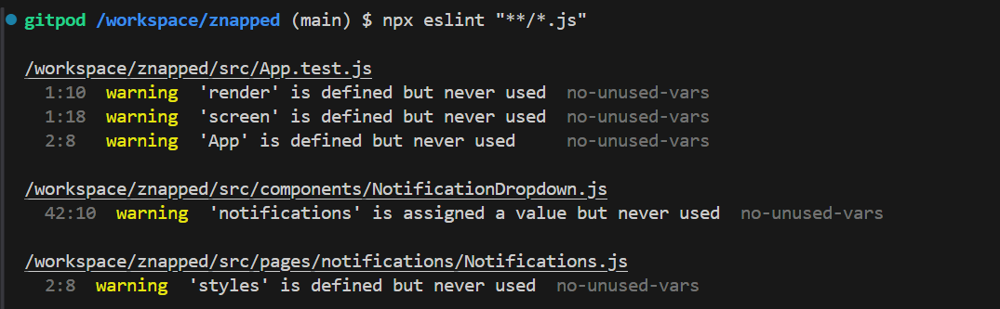

  
ESLint all clear

   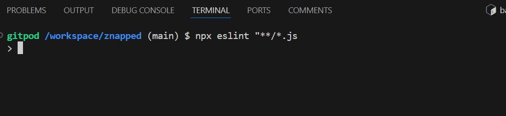

### Lighthouse
Ligthouse testing was carried out in Incognito mode to achieve best results.

  
Lighthouse results desktop

   

  
Lighthouse results mobile

   

## Browser Testing

Inventory Manager was tested on Microsoft Edge, Google Chrome, Firefox and Safari browsers and no issues were noted.

| Browser               | Functionality| Layout  |
|---------------------- |------------- |---------|
| Chrome                |       ✔     |     ✔   |
| Edge                  |       ✔     |     ✔   |
| Firefox               |       ✔     |     ✔   |
| Safari                |       ✔     |     ✔   |

## Device Testing
  The website was tested on different devices to ensure responsiveness on various screen sizes.Microsoft Edge developer tools was used to test and to check the responsivness on multiple devices. I also used [Am I responsive](https://ui.dev/amiresponsive) to test the responsivness. Initially I couldn't sign in on my iphone, 12 and also tried another iphone 13. Upon research I found that had to untick "Prevent cross-site tracking", and after doing so I could log in on my iphone.

| Device                      | Functionality| Layout |
|---------------------------- |--------------|--------|
| Iphone 8                    |       ✔     |     ✔  |
| Ihone mini 12               |       ✔     |     ✔  |
| Iphone 13 Pro               |       ✔     |     ✔  |
| Samsung Galaxy S21          |       ✔     |     ✔  |
| Samsung Galaxy Tab S6 lite  |       ✔     |     ✔  |
| Laptop                      |       ✔     |     ✔  |
| Desktop                     |       ✔     |     ✔  |

  ## Friends and Family
   - Family members and friends were asked to test the website for bugs and overall experience.

## Bugs
I encountered numerous bugs and errors throughout this project. The errors would at times originate from the backend, and other times from the front-end. As this is my first React project, most of the errors and bugs I encountered were learning curves, initial hurdles and typos. Many of the errors were related to 401 unauthorized errors, refresh and user. I eg. had to add a check to ensure a refresh token exists before trying to refresh. I also had to adjust the useEffect hooks for messages to exit early and wait for currentUser to be set.

The images below will display some of the issues resolved:

  
401 unauthorized

  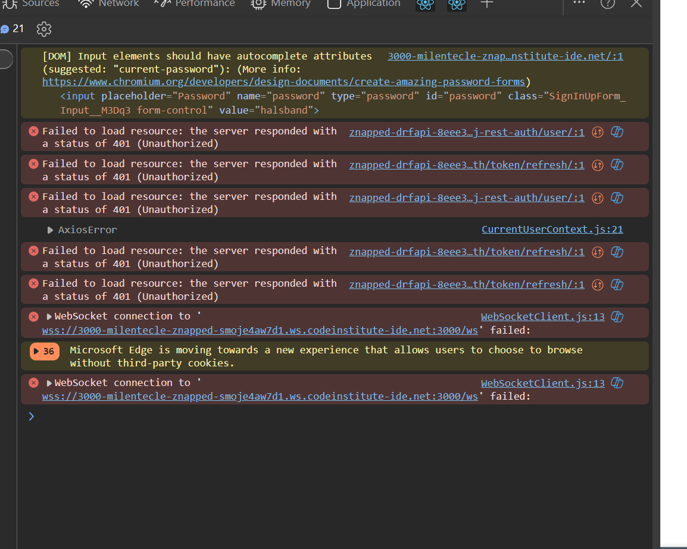

  
Invalid token

Refresh token errors:

  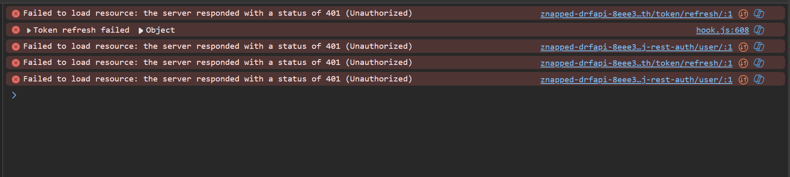

 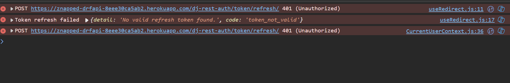

 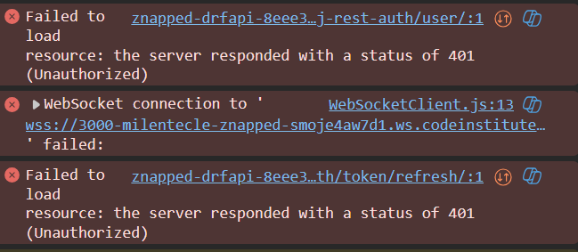

  
Axios error create post

  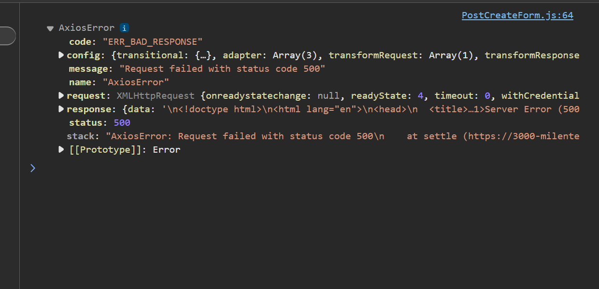

  
500 internal server error create post

  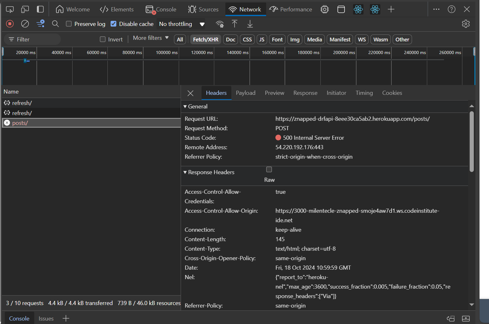

  
Current user undefined

  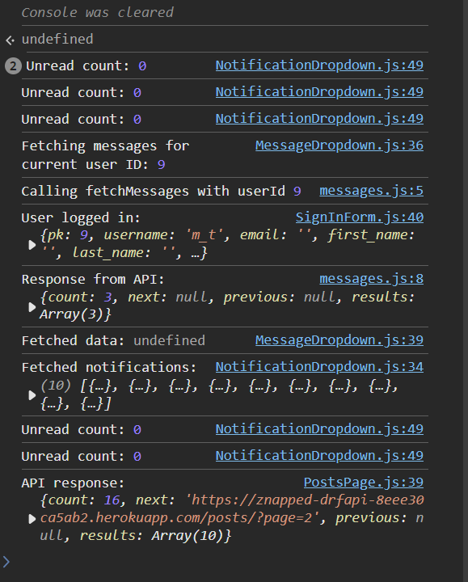

  
Page not found notifications

  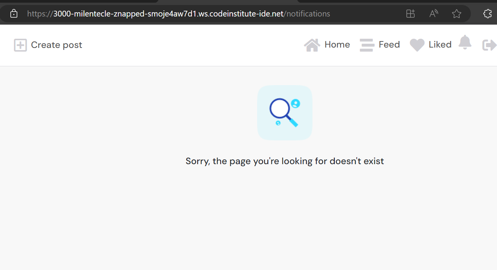

  
TypeError username messages

  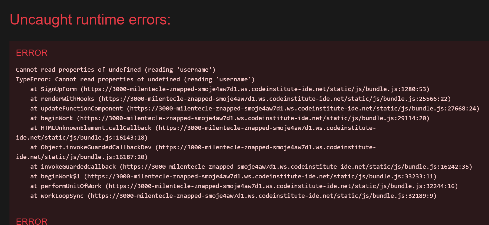

  
TypeError hashtags

  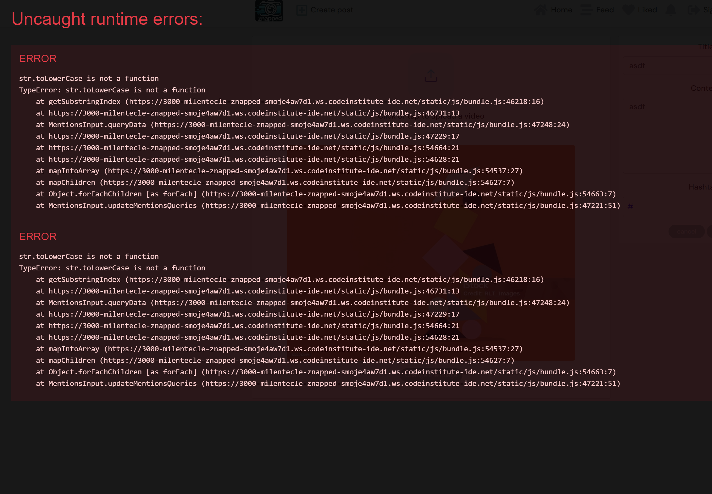

## Python Automated Testing
Automated testing was conducted on specific components of the application, focusing on key features utilizing Django's built-in 'TestCase' class. Although, given more time the intention was to extend the automated tests to include more features and scenarios. A thourough manual testing process was also implemented.

**Test** | **Description** | **Result** |
|:-----|:------|:------|
|test_inventory_form_valid| Verifies that the "InventoryForm" is validated when provided with a valid category and name. This test ensures that the form's validation logic properly accepts correct input.| Passed
|test_inventory_form_invalid| Tests the "InventoryForm" for correct handling of invalid submissions, specifically when mandatory fields are missing. This test is to confirm that the form's logic handles incomple och incorrect submissions correctly.| Passed
|test_items_form_valid| Verifies that the "ItemsForm" validates correctly when provided with valid data. This test ensures that the form properly handles valid user inputs for item creation.| Passed
|test_items_form_invalid| Test the form handling for invalid submissions, such as when item name is missing.  This test is to confirm that the form's logic handles incomplete och incorrect submissions correctly to prevent data integrity errors.| Passed
|test_create_inventory| Tests the functionality of creating a new inventory list through a POST request, verifying that the list is correctly added to the database and that the user is redirected correctly.| Passed
|test_delete_list| Tests the functionality of deleting an inventory list, verifying that after deletion, the list is deleted from the database and the user redirected correctly.| Passed